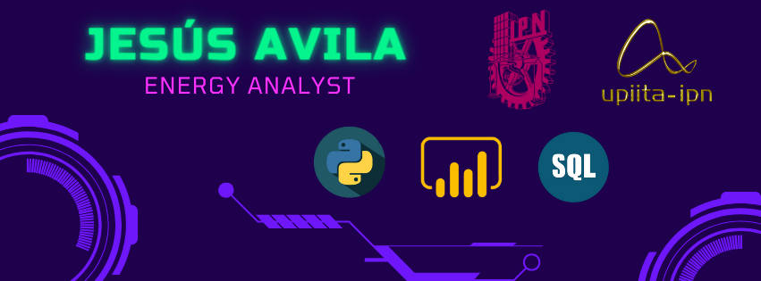

#   Hello, Im Jesús 
## Energy Analyst | Energy Engineer

> 

>
>>
>

>
>>

Hello! I'm Luis Jesús Avila, an Energy Engineer transitioning into a specialized role as an Energy Analyst. My academic background and professional focus are centered around harnessing data to drive innovations and efficiencies in the energy sector. I am proficient in Python, which I often utilize to dissect complex datasets and model energy systems. Additionally, I am skilled in using tools like Power BI, Excel, SQL, and QGIS to support my analytical work. I'm passionate about translating data insights into actionable strategies that optimize energy use and promote sustainability. Let's connect and explore how we can make a significant impact together!

